# StreamPay


**StreamPay** is a decentralized recurring-payment / subscription-stream service built on **Stellar Testnet** with a **Soroban smart contract**. It allows a sender to lock funds into an on-chain escrow contract that disburses a fixed amount to a recipient on a cadence (e.g. weekly, monthly) until an installment count is reached or the sender cancels. Because Soroban contracts cannot self-execute, an off-chain **watcher** cron triggers `pay_next()` on schedule.

> **🚀 Live Demo:** [https://streampay.vercel.app](https://streampay.vercel.app)

> **Quick Stats:** 2 wallets (Freighter + Lobstr) | 82 tests (71 frontend + 11 contract) | 5 Soroban event types | 8 contract error codes | CI/CD pipeline with 3 workflows

### Tech Stack

| Layer          | Technology                                | Version          |
| -------------- | ----------------------------------------- | ---------------- |
| Frontend       | React + TypeScript                        | 18 / ^5.6        |
| Build          | Vite + Tailwind CSS                       | 5 / 3            |
| Wallet         | `@creit.tech/stellar-wallets-kit`         | latest           |
| Stellar SDK    | `@stellar/stellar-sdk`                    | 12+              |
| Smart Contract | Rust + Soroban SDK                        | SDK 27, `no_std` |
| State          | Zustand                                   | latest           |
| Routing        | React Router                              | 6                |
| Testing        | Vitest (frontend) + Cargo test (contract) | latest           |
| Linting        | ESLint + Prettier                         | latest           |
| CI/CD          | GitHub Actions                            | —                |

---

## Screenshots

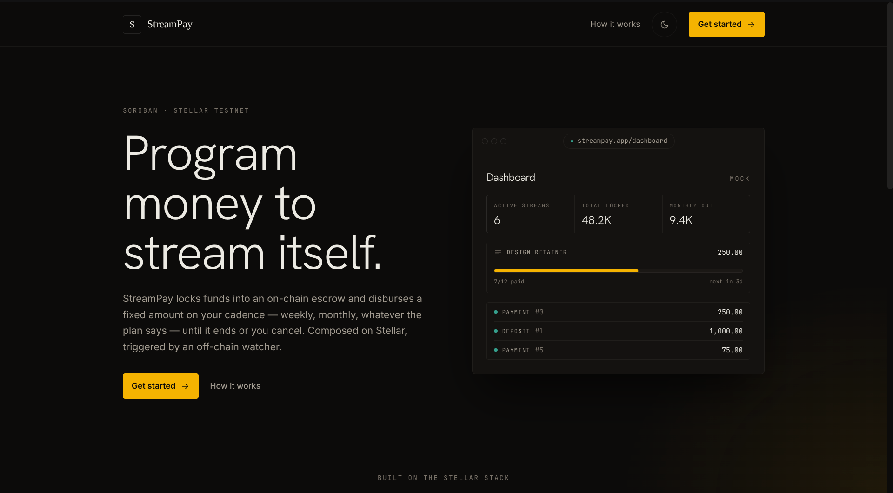
*The StreamPay landing page introducing programmable recurring payments on Stellar.*

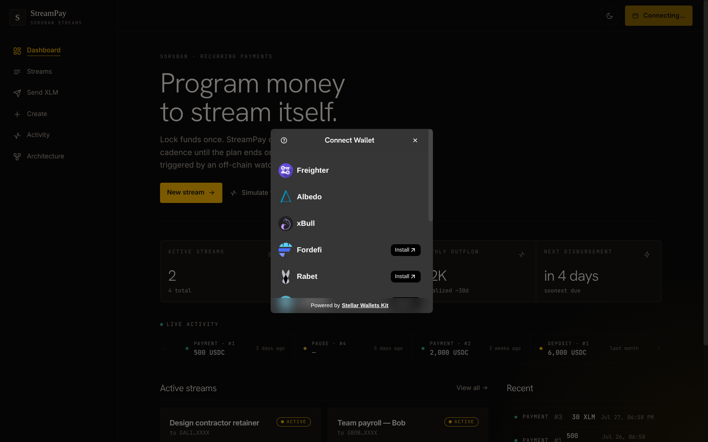
*Connecting a Freighter wallet to begin interacting with the dApp.*

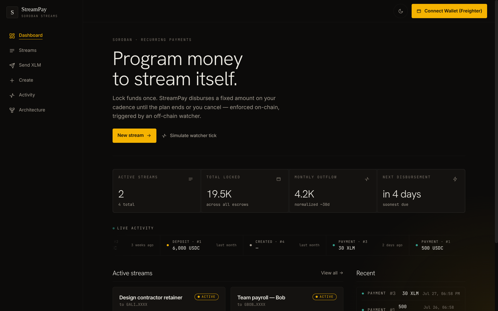
*Dashboard overview showing active streams, locked totals, and live event activity.*

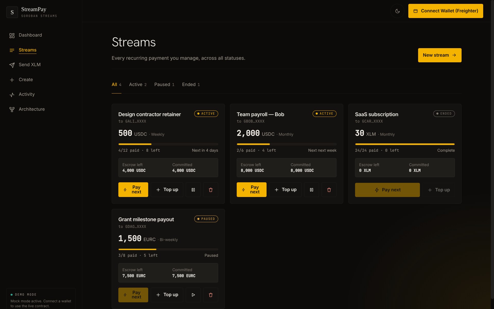
*Streams view listing all active and completed subscription schedules.*

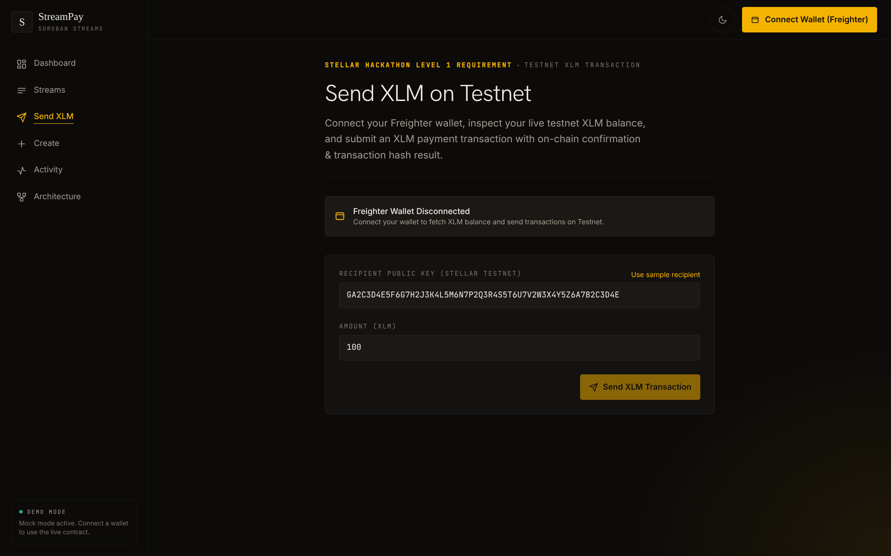
*Sending a direct XLM payment to any Stellar address on Testnet.*

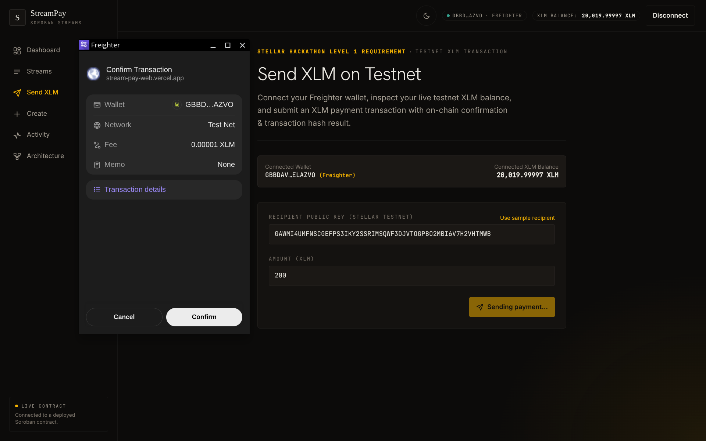
*The in-progress transaction view showing the 6-stage progress spinner while a payment is being submitted and confirmed.*

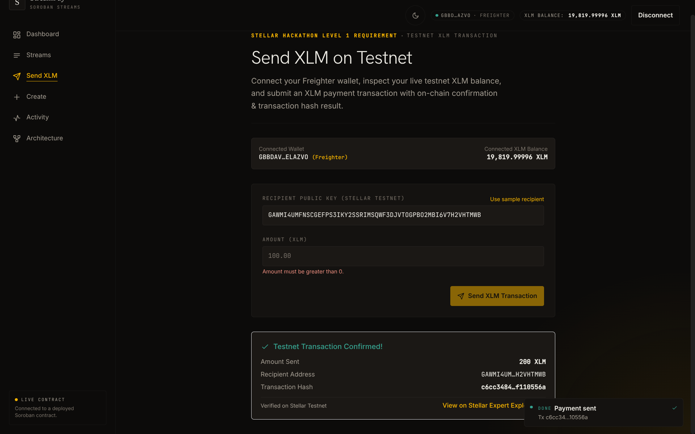
*A successful payment confirmation panel with the transaction hash and Stellar Expert explorer link.*

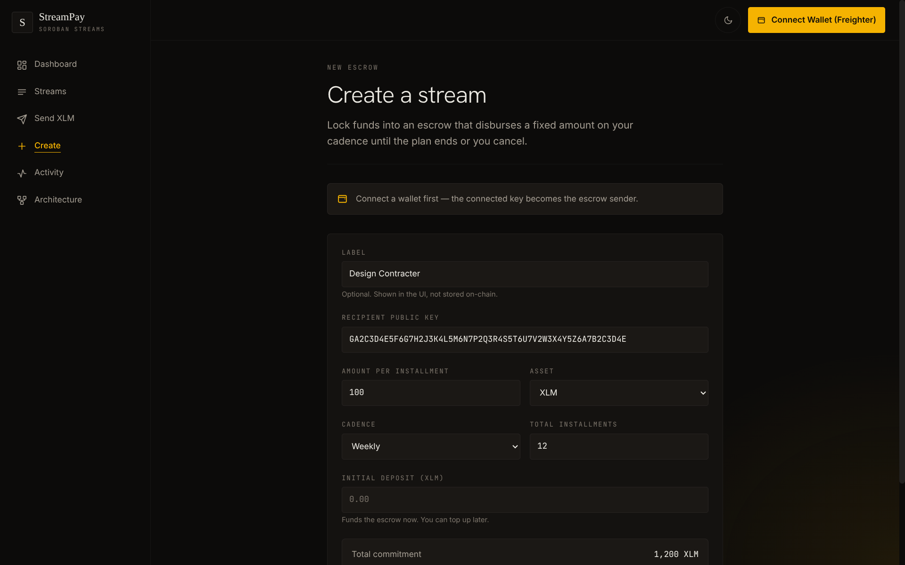
*Creating a new subscription stream by specifying recipient, amount, cadence, and deposit.*

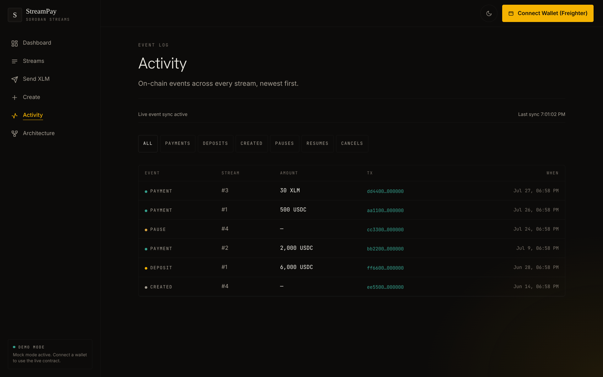
*Real-time event feed showing all contract events including payments, deposits, and cancellations.*

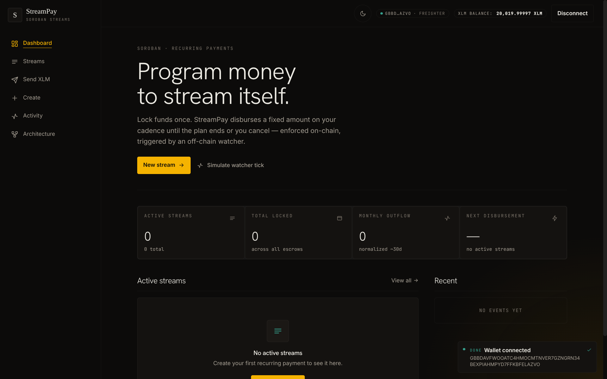
*Disconnecting the wallet to return to the mock/demo mode.*

---

## Demo Video

▶️ [Watch the 2-minute demo on YouTube](https://youtu.be/REPLACE_WITH_YOUR_VIDEO_ID)

*Full walkthrough: wallet connection, creating a stream, sending XLM, and viewing live contract events.*

---

## CI/CD Pipeline

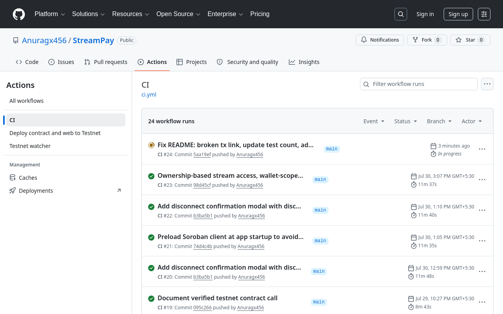
*GitHub Actions CI workflow running lint, build, and test checks on push to main.*

Three automated workflows:

| Workflow | Trigger | What it does |
| --- | --- | --- |
| `ci.yml` | Push/PR to main | Lint → Build → Test (frontend + watcher + contract) |
| `deploy-testnet.yml` | Manual dispatch | Full deploy: contract build + testnet deploy + Vercel production deploy |
| `watcher.yml` | Cron (every 5 min) | Runs off-chain watcher against deployed contract |

---

## Test Output

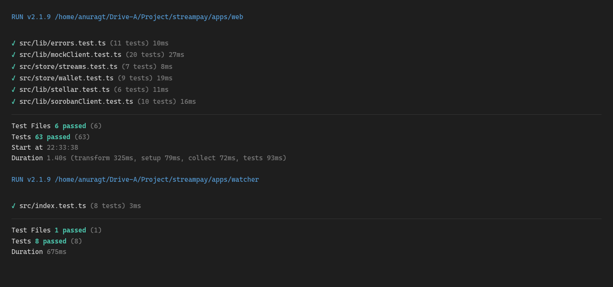
*82 passing tests: 71 Vitest (frontend + watcher) and 11 Cargo tests (Soroban contract).*

```
 ✓ src/lib/errors.test.ts (11 tests)
 ✓ src/lib/mockClient.test.ts (20 tests)
 ✓ src/store/streams.test.ts (7 tests)
 ✓ src/store/wallet.test.ts (9 tests)
 ✓ src/lib/stellar.test.ts (6 tests)
 ✓ src/lib/sorobanClient.test.ts (10 tests)

 Test Files  6 passed (6)
      Tests  63 passed (63)

 ✓ src/index.test.ts (8 tests)

 Test Files  1 passed (1)
      Tests  8 passed (8)
```

---

## Contract

| Field           | Value                                                                                                                               |
| --------------- | ----------------------------------------------------------------------------------------------------------------------------------- |
| **Contract ID** | `CDZRFAGIPKFP2RRAKQK2GHNSENKWMCP37AK5ZQDVEPT4RP2N6N3V6A3N`                                                                          |
| **Soroban RPC** | `https://soroban-testnet.stellar.org`                                                                                               |
| **Horizon**     | `https://horizon-testnet.stellar.org`                                                                                               |
| **Explorer**    | [View on Stellar Expert](https://stellar.expert/explorer/testnet/contract/CDZRFAGIPKFP2RRAKQK2GHNSENKWMCP37AK5ZQDVEPT4RP2N6N3V6A3N) |
| **Package**     | `contracts/subscription`                                                                                                            |
| **Network**     | Stellar Testnet                                                                                                                     |

### Verified Contract Call

Successful Testnet transaction produced by the frontend contract flow:

`6ed7e283fc9f865db41733f41ad1e6d03c4f834474c883df907795c332875e48`

[View the transaction on Stellar Expert](https://stellar.expert/explorer/testnet/tx/6ed7e283fc9f865db41733f41ad1e6d03c4f834474c883df907795c332875e48)

### Contract Functions

| Function                                                                     | Description                                                  |
| ---------------------------------------------------------------------------- | ------------------------------------------------------------ |
| `init_schedule(sender, recipient, amount, asset, cadence_secs, total_count)` | Create a new subscription schedule (sender auth required)    |
| `deposit(schedule_id, amount)`                                               | Top up escrow for a schedule, pulls tokens from sender       |
| `pay_next(schedule_id)`                                                      | Disburse next installment — permissionless (anyone can call) |
| `pause(schedule_id)`                                                         | Pause an active schedule (sender only)                       |
| `resume(schedule_id)`                                                        | Resume a paused schedule (sender only)                       |
| `cancel(schedule_id)`                                                        | Cancel a schedule and refund remaining escrow (sender only)  |
| `get_schedule(schedule_id)`                                                  | Read a schedule's full state                                 |

### Contract Events

| Event     | Emitted When                            |
| --------- | --------------------------------------- |
| `created` | A new schedule is initialized           |
| `payment` | A successful `pay_next` disburses funds |
| `deposit` | Escrow is topped up via `deposit`       |
| `cancel`  | A schedule is cancelled with refund     |
| `status`  | Schedule is paused or resumed           |

### Contract Error Codes

| Code | Name                  | Description                                                   |
| ---- | --------------------- | ------------------------------------------------------------- |
| 1    | `ScheduleNotFound`    | Schedule id does not exist                                    |
| 2    | `NotYetDue`           | `pay_next` called before `last_paid_ts + cadence_secs`        |
| 3    | `InsufficientDeposit` | Escrow less than per-installment amount                       |
| 4    | `AlreadyComplete`     | All installments already paid                                 |
| 5    | `NotActive`           | Action requires schedule to be Active                         |
| 6    | `AlreadyEnded`        | Action invalid for ended schedule                             |
| 7    | `InvalidArgument`     | Numeric argument out of range (amount <= 0, count == 0, etc.) |
| 8    | `NotPaused`           | Resume called on a schedule that is not Paused                |

---

## Features

- **Multi-wallet support** — Connect with Freighter or Lobstr via `@creit.tech/stellar-wallets-kit`
- **Direct XLM payments** — Send XLM to any Stellar address on Testnet (Level 1 flow)
- **Soroban subscription contract** — Escrow-backed recurring payments with schedule lifecycle management
- **Real-time event streaming** — Polls Soroban RPC every 5 seconds for contract events
- **Auto-reconnect** — Wallet session persists across page reloads via localStorage
- **Balance display** — Live XLM balance in top bar from Horizon
- **Friendbot funding** — One-click testnet account funding on the Send view
- **Transaction feedback** — 6-stage `TransactionProgress` spinner and success/failure banner with Stellar Expert link
- **Mock mode** — Full in-memory demo without a deployed contract (set `VITE_CONTRACT_ID` to go live)
- **Off-chain watcher** — Node + TypeScript cron that scans and calls `pay_next()` for due schedules
- **Light / dark / system theming** — Persisted toggle
- **Mobile-responsive UI** — Sidebar drawer, responsive grids, fluid typography

---

## Level 1 — Wallets, Contracts, Transactions, Multi-Wallet

> **Checklist** — All 5 requirements met:
>
> - [x] Freighter wallet setup on Stellar Testnet
> - [x] Wallet connect + disconnect
> - [x] XLM balance fetch + display
> - [x] XLM transaction with success/failure feedback + tx hash
> - [x] Dev standards (UI, wallet, balance, tx, error handling)

### 1. Wallet Setup

| Requirement        | Implementation                                                                                                                  |
| ------------------ | ------------------------------------------------------------------------------------------------------------------------------- |
| Freighter wallet   | `@creit.tech/stellar-wallets-kit` with `FreighterModule` + `LobstrModule`                                                       |
| Stellar Testnet    | Hardcoded via `WalletNetwork.TESTNET` — Horizon (`horizon-testnet.stellar.org`) and Soroban RPC (`soroban-testnet.stellar.org`) |
| Network resolution | `resolveNetwork()` in `lib/walletKit.ts` returns `TESTNET` by default                                                           |

**Key files:** `apps/web/src/lib/walletKit.ts`, `apps/web/src/lib/constants.ts`

### 2. Wallet Connection

| Requirement      | Implementation                                                                                                                    |
| ---------------- | --------------------------------------------------------------------------------------------------------------------------------- |
| Connect          | Top-bar "Connect wallet" button opens the StellarWalletsKit selector modal; `store/wallet.ts:connect()` stores address and signTx |
| Disconnect       | Top-bar disconnect button calls `store/wallet.ts:disconnect()` — tears down kit session and clears Zustand state                  |
| Auto-reconnect   | On app load, restores persisted session from localStorage                                                                         |
| State management | `useWalletStore` exposes `address`, `balance`, `network`, `isConnected`                                                           |

**Key files:** `apps/web/src/store/wallet.ts`, `apps/web/src/lib/walletKit.ts`

### 3. Balance Handling

| Requirement       | Implementation                                                                                                                |
| ----------------- | ----------------------------------------------------------------------------------------------------------------------------- |
| Fetch XLM balance | `lib/stellar.ts:fetchXlmBalance(address)` calls `server.loadAccount(address)` via Horizon and finds `asset_type === "native"` |
| Display           | XLM balance shown in the top bar (`BalanceDisplay` component) next to the truncated public key, and on the **Send** view      |
| Unfunded accounts | Shows zero balance with inline "Fund with Friendbot" action                                                                   |

**Key files:** `apps/web/src/lib/stellar.ts`, `apps/web/src/components/Topbar.tsx`

### 4. Transaction Flow

| Requirement      | Implementation                                                                                                                                  |
| ---------------- | ----------------------------------------------------------------------------------------------------------------------------------------------- |
| Send XLM         | `lib/stellar.ts:sendXlmPayment()` builds a `TransactionBuilder` with `Operation.payment()`, signs via the connected wallet, submits via Horizon |
| Success feedback | Green success panel showing amount, recipient, **transaction hash**, and clickable **Stellar Expert explorer link**; also shown in a toast      |
| Failure feedback | Red error panel with descriptive error message mapped from `errors.ts`                                                                          |
| Transaction hash | Returned from `submitTransaction()` and embedded in the explorer link                                                                           |
| Pre-flight check | Verifies sender has sufficient XLM before submitting                                                                                            |

**Key files:** `apps/web/src/views/Send.tsx`, `apps/web/src/lib/stellar.ts`, `apps/web/src/lib/types.ts`

### 5. Development Standards

| Requirement        | Implementation                                                                                                                                                      |
| ------------------ | ------------------------------------------------------------------------------------------------------------------------------------------------------------------- |
| UI setup           | Vite + React 18 + TypeScript + Tailwind CSS 3 + React Router 6                                                                                                      |
| Wallet integration | `@creit.tech/stellar-wallets-kit` wrapping Freighter and Lobstr with theme sync                                                                                     |
| Balance fetch      | Horizon SDK `loadAccount` with 404 handling for unfunded accounts                                                                                                   |
| Transaction logic  | Full pipeline — validation, build, sign, submit, confirm                                                                                                            |
| Error handling     | 6 error categories in `lib/errors.ts` (rejected, wallet, escrow, balance, RPC, fallback); try/catch on every async path; toast notifications for user-facing errors |
| Testing            | Vitest unit tests covering wallet store, error helpers, contract mock, soroban client, and component rendering                                                      |
| Linting            | ESLint + Prettier configuration                                                                                                                                     |

**Key files:** `apps/web/src/lib/errors.ts`, `apps/web/src/lib/`

---

## Level 2 — Multi-wallet, Contracts & Events, Writing Contract

> **Checklist** — All 6 requirements met:
>
> - [x] 3+ error types handled
> - [x] Contract deployed on testnet
> - [x] Contract called from the frontend
> - [x] Transaction status visible
> - [x] 2+ meaningful commits
> - [x] Multi-wallet support + real-time events

### 1. Three Error Types Handled

| Error Category             | Location                                          | Handles                                                                                                                                                               |
| -------------------------- | ------------------------------------------------- | --------------------------------------------------------------------------------------------------------------------------------------------------------------------- |
| **Wallet / Rejection**     | `lib/errors.ts` — `rejected` / `wallet`           | User rejects signature in Freighter, wallet unavailable/locked, wrong network                                                                                         |
| **Escrow / Contract**      | `lib/errors.ts` — `escrow` / contract error codes | 8 contract error codes mapped: `ScheduleNotFound`, `InsufficientDeposit`, `AlreadyComplete`, `NotYetDue`, `NotActive`, `AlreadyEnded`, `InvalidArgument`, `NotPaused` |
| **Balance / Insufficient** | `lib/errors.ts` — `balance`                       | Insufficient XLM for transaction fee, insufficient escrow for installment                                                                                             |
| **RPC / Submission**       | `lib/errors.ts` — `rpc` / `fallback`              | Soroban RPC simulation failures, Horizon timeout, network errors                                                                                                      |

Every async path has try/catch with descriptive error messages surfaced to the user via toast notifications and inline error panels.

**Key file:** `apps/web/src/lib/errors.ts`

### 2. Contract Deployed on Testnet

| Detail          | Value                                                                                                                                                                    |
| --------------- | ------------------------------------------------------------------------------------------------------------------------------------------------------------------------ |
| Contract ID     | `CDZRFAGIPKFP2RRAKQK2GHNSENKWMCP37AK5ZQDVEPT4RP2N6N3V6A3N`                                                                                                               |
| Package         | `contracts/subscription`                                                                                                                                                 |
| Soroban SDK     | 27, `no_std`                                                                                                                                                             |
| Deploy workflow | `.github/workflows/deploy-testnet.yml` — builds WASM, deploys via `stellar contract deploy`, initializes instance storage, verifies on-chain, deploys frontend to Vercel |
| Explorer        | [View on Stellar Expert](https://stellar.expert/explorer/testnet/contract/CDZRFAGIPKFP2RRAKQK2GHNSENKWMCP37AK5ZQDVEPT4RP2N6N3V6A3N)                                      |

### 3. Contract Called from the Frontend

The frontend interacts with the contract through `lib/contract.ts`, which provides a typed facade with a mock/live seam:

- **Real client** (`lib/sorobanClient.ts`): `invokeSigned()` for mutating calls (`init_schedule`, `deposit`, `pay_next`, `pause`, `resume`, `cancel`) — builds Soroban transaction, simulates via Soroban RPC, signs via wallet, submits and polls for confirmation. Read-only calls use `simulateRead()` for gas-free queries (`get_schedule`).
- **Mock client** (`lib/mockClient.ts`): In-memory store that mirrors the contract's logic for development/demo without a deployed contract.
- **Seam**: `lib/contract.ts` picks mock or real at runtime based on `VITE_CONTRACT_ID` env var; views are identical across modes.

**Key files:** `apps/web/src/lib/contract.ts`, `apps/web/src/lib/sorobanClient.ts`, `apps/web/src/lib/mockClient.ts`

### 4. Transaction Status Visible

| Status               | UI Feedback                                                                                                                 |
| -------------------- | --------------------------------------------------------------------------------------------------------------------------- |
| `awaiting_signature` | Waiting for wallet approval — "Awaiting wallet signature…" message                                                          |
| `submitting`         | Transaction submission in progress — spinner                                                                                |
| `pending`            | Polling for ledger confirmation — spinner                                                                                   |
| `success`            | Green panel with amount, recipient/action, **transaction hash**, and [Stellar Expert](https://stellar.expert) explorer link |
| `failed`             | Red panel with error description mapped from the 8 contract error codes or 6 error categories                               |

The `TransactionProgress` type drives per-stage rendering in `TransactionFeedback` views. Toasts mirror both success and failure outcomes.

**Key files:** `apps/web/src/lib/types.ts`, `apps/web/src/components/TransactionFeedback.tsx`

### 5. Meaningful Commits (2+ required)

| Date       | Commit    | Description                                                                                  |
| ---------- | --------- | -------------------------------------------------------------------------------------------- |
| 2026-07-24 | `d81e143` | `Initial commit: StreamPay Soroban subscription streams` — full contract + frontend scaffold |
| 2026-07-25 | `22c8030` | `Redesigned UI and Updated Readme for Level 1` — redesigned UI, mock mode, Level 1 flow      |

### 6. Multi-wallet Support + Real-time Events

**Multi-wallet support:**
StreamPay supports **2 wallets** via `@creit.tech/stellar-wallets-kit`:

| Wallet    | Module                                      |
| --------- | ------------------------------------------- |
| Freighter | `@creit.tech/stellar-wallets-kit` (default) |
| Lobstr    | `@creit.tech/stellar-wallets-kit`           |

The wallet selector modal renders the kit's built-in wallet picker. Session is persisted and auto-restored on reload.

**Real-time event integration:**
The frontend polls contract events via the streams store's `pollEvents` in the `Streams` and `Activity` views:

- Polls every **5 seconds** via Soroban RPC `getEvents` endpoint
- Stores an RPC cursor per contract in localStorage for incremental fetching
- Deduplicates events by event ID
- Falls back to a recent-ledger backfill when a cursor is no longer accepted
- Filters and displays events by type (`created`, `payment`, `deposit`, `cancel`, `status`)
- Shows loading spinner, last-sync timestamp, and error state for the event feed

**Key files:** `apps/web/src/store/streams.ts`, `apps/web/src/views/Activity.tsx`, `apps/web/src/views/Streams.tsx`

---

## How the Contract Works

The Soroban smart contract (`contracts/subscription/src/lib.rs`, 418 lines) implements an escrow-based recurring payment system.

### Core Data Model

Each subscription is a `Schedule` struct stored in persistent storage:

| Field          | Type      | Description                                                        |
| -------------- | --------- | ------------------------------------------------------------------ |
| `sender`       | `Address` | Who funds the escrow and can pause/resume/cancel                   |
| `recipient`    | `Address` | Who receives installment payments                                  |
| `amount`       | `i128`    | Per-installment amount (stroops for XLM)                           |
| `asset`        | `Address` | Token contract address of the streamed asset                       |
| `cadence_secs` | `u64`     | Seconds between eligible disbursements                             |
| `total_count`  | `u32`     | Total installments the schedule will ever pay                      |
| `paid_count`   | `u32`     | Installments paid so far (invariant: ≤ `total_count`)              |
| `last_paid_ts` | `u64`     | Ledger timestamp of last payment (0 before first)                  |
| `deposit`      | `i128`    | Escrow remaining in the contract                                   |
| `status`       | `Status`  | Lifecycle: `Active`, `Paused`, or `Ended`                          |
| `created_ts`   | `u64`     | Ledger timestamp at creation (cadence anchor before first payment) |

Schedules are keyed by auto-incrementing `u64` ids (`DataKey::Counter` → `DataKey::Schedule(id)`).

### Lifecycle

1. `init_schedule` — Creates a schedule. Requires `sender.require_auth()`. Rejects non-positive `amount`, zero `total_count`, or zero `cadence_secs`. Escrow starts at 0 (funded separately via `deposit`). Emits `created` event. Returns the new schedule id.
2. `deposit` — Top up escrow. Requires sender auth. Pulls `amount` of the schedule's `asset` from sender into the contract via `token::TokenClient::transfer` (inter-contract call to the Stellar Asset Contract). Updates `deposit`. Rejects if schedule is `Ended`. Emits `deposited` event.
3. `pay_next` — Disburse one installment. **Permissionless** (no auth required) — safety rests on four guards, not on who calls:

- `status == Active`
- `paid_count < total_count` (installment cap)
- `deposit >= amount` (escrow sufficiency)
- `now >= anchor + cadence_secs` (timing guard, where `anchor` = `last_paid_ts` if set, else `created_ts`)
  **Security**: Effects are applied _before_ the token transfer (decrement escrow, advance `paid_count`, set `last_paid_ts = now`, potentially set `status = Ended`) — defeating re-entrancy because storage is already updated before the external call. On the final installment, status automatically transitions to `Ended`. Emits `payment` event.

4. `pause` **/** `resume` — Sender-only lifecycle control. Resuming does **not** shift the cadence anchor — if an interval elapsed while paused, the schedule is immediately due. Emits `status` event.
5. `cancel` — Sender-only. Zeroes escrow and sets `status = Ended` in storage _before_ the refund transfer (re-entrancy protection). Conditionally transfers remaining `deposit` back to sender. Emits `cancel` event.

### Security Model

- **Auth**: Every sender-acting call (`init_schedule`, `deposit`, `pause`, `resume`, `cancel`) requires `Address::require_auth` on the _stored_ sender — the caller is never trusted to assert who the sender is.
- **Double-withdrawal prevention**: Two independent guards in `pay_next`: a monotonic timestamp guard (`now >= last_paid_ts + cadence` via `saturating_add`) and an installment counter (`paid_count < total_count`).
- **Re-entrancy protection**: Effects (state changes) are applied before external calls (token transfers) in both `pay_next` and `cancel`.
- **Overflow**: `overflow-checks` is enabled in release; `saturating_add` on cadence guard prevents timestamp arithmetic attacks.
- **Inter-contract calls**: Uses `token::TokenClient` to call the Stellar Asset Contract's `transfer()`, making the contract compatible with any Stellar asset (native XLM, USDC, etc.).

### Off-chain Watcher

The watcher (`apps/watcher/`) is a Node + TypeScript cron that polls the contract's schedules (probing contiguous ids), applies the same due-check logic the contract enforces, and submits signed `pay_next()` transactions from a funded account. `pay_next` is permissionless by design, so the watcher's account only pays fees — it never needs the sender's auth. Runs as a continuous loop or a single `--once` pass.

### Test Coverage

- **Contract** (`contracts/subscription/src/test.rs`): Covers schedule init, auth, deposit, timing guard, insufficient deposit, full payout, cancel refund, pause/resume, typed events, unauthorized access, and permissionless `pay_next`.
- **Frontend** (tests co-located with source files): 71 tests across 6 files covering wallet store, error helpers, mock client, soroban client, streams store, and component rendering.
- **Watcher** (`apps/watcher/`): 8 tests covering due-check logic.

---

## Project Structure

```
streampay/
├── apps/
│   ├── web/              # Vite + React + TS + Tailwind frontend
│   │   ├── src/
│   │   │   ├── components/   # Reusable UI components
│   │   │   ├── hooks/        # Custom React hooks
│   │   │   ├── lib/          # Core logic (stellar, wallet, contract, errors)
│   │   │   ├── store/        # Zustand state stores
│   │   │   ├── test/         # Test setup (tests co-located with source files)
│   │   │   └── views/        # Page-level views
│   │   └── ...
│   └── watcher/          # Node + TS off-chain pay_next cron
├── contracts/
│   └── subscription/     # Soroban Rust contract + Rust tests
├── .github/workflows/
│   ├── ci.yml            # Lint + test + build
│   ├── deploy-testnet.yml # Manual contract + frontend deploy
│   └── watcher.yml       # Cron watcher (every 5 min)
├── .env.example
└── package.json          # npm workspaces
```

## How to Verify

### Step 1: Verify Contract Deployment

[View Contract on Stellar Expert](https://stellar.expert/explorer/testnet/contract/CDZRFAGIPKFP2RRAKQK2GHNSENKWMCP37AK5ZQDVEPT4RP2N6N3V6A3N)

### Step 2: Run Smart Contract Tests

```bash
cd contracts/subscription && cargo test
```

### Step 3: Run Frontend and Watcher Tests

```bash
npm install && npm test
```

### Step 4: Run Lint and Build

```bash
npm run lint && npm run build
```

### Step 5: Run the Application Locally

```bash
npm install
cp .env.example .env   # VITE_CONTRACT_ID can be empty for mock mode
npm run dev             # http://localhost:5173
```

### Step 6: Verify Multi-wallet Support

Click "Connect wallet" — the selector shows Freighter and Lobstr.

### Step 7: Verify Transaction Flow

1. Connect Freighter on Testnet
2. Check balance in top bar
3. Navigate to **Send**, paste a testnet `G…` address, enter an amount, send
4. Verify green success panel with Stellar Expert tx link

### Step 8: Verify Soroban Contract Interaction

1. Set `VITE_CONTRACT_ID` to the deployed contract ID
2. Restart the dev server
3. Navigate to **Create** and initialize a schedule
4. Approve the wallet signature
5. Verify the success panel and the event appearing in **Activity**

---

## Useful Links

- [Contract on Stellar Expert](https://stellar.expert/explorer/testnet/contract/CDZRFAGIPKFP2RRAKQK2GHNSENKWMCP37AK5ZQDVEPT4RP2N6N3V6A3N)
- [Stellar Testnet](https://stellar.org/developers/tools)
- [Freighter Wallet](https://www.freighter.app/)
- [Soroban Documentation](https://soroban.stellar.org/)
- [Repository](https://github.com/Anuragx456/StreamPay)
